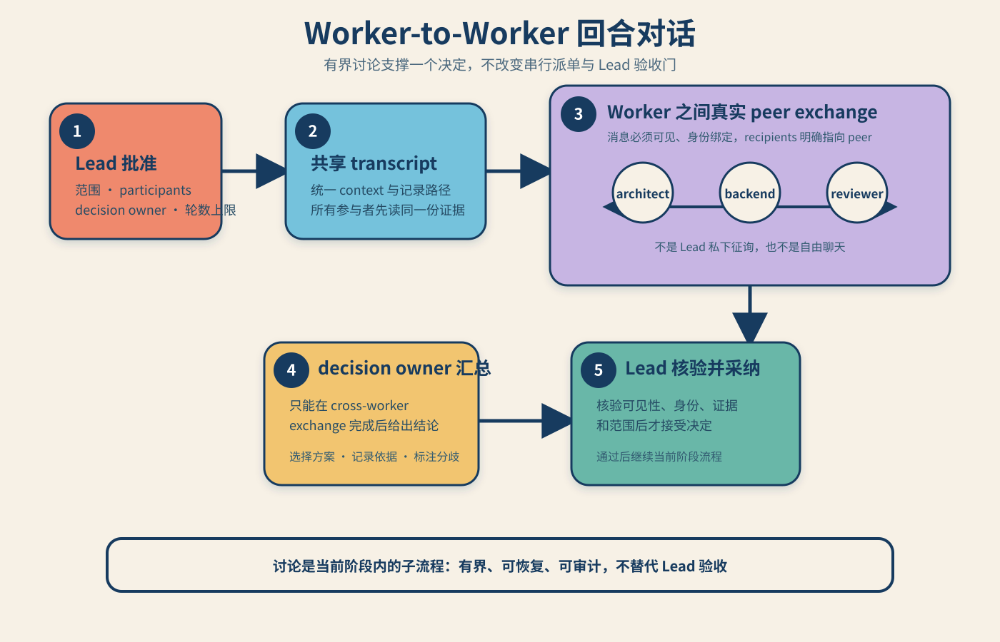

# agent-team-work

`agent-team-work` 用于在 Codex 项目中建立和运行严格串行的项目会话团队：一个当前 Leader，加上同一项目中的独立角色会话。它帮助团队先确认目标、角色、阶段和完成标准，再按已验收的阶段逐步派单。

## 主要功能

- 通过菜单确认项目、目标、角色、阶段顺序、DoD 和 `automatic` / `confirmation` 门控。
- 绑定真实项目和会话，避免重复创建 Leader 或把普通子代理当作团队成员。
- 只有成员报告、产物和能力门验收通过后，才推进下一阶段。
- Worker 回合采用摘要优先的双层呈现：最终回复必须含独立标题 `Human-readable summary` 和 `Technical details`，先展示角色结论、产物、验证和风险，技术身份与执行细节保留在后部供 Lead 核验。
- 中断后按项目状态恢复；返修复用原成员并递增 `attempt`。
- 首轮完成后的修改先由 Lead 做 `impact_analysis`，记录新的 `revision_cycle`，再只派受影响阶段和必要下游阶段。
- 支持有界的 `worker_can_request` 讨论回合：由 Lead 批准范围和决策 owner，要求参与者在共享 transcript 中进行真实 peer exchange 后才能形成决定。

不用于概念解释、单次会话管理、普通子代理、并行 worker、Orca team、Sub-Lead 或子团队。

## 安装与运行

1. 下载 [runtime-only 发布包](dist/agent-team-work.zip)，解压到目标 Agent Skills 目录，或按宿主平台的 Skill 安装方式复制包体。归档已包含四个平台适配器。
2. 在目标项目中显式调用 `$agent-team-work`。通常只需要说明想做什么，不必预先写角色和阶段；Skill 会先通过菜单补齐这些信息。
3. 首次建队先完成菜单摘要和一次最终确认；只读查看已有团队时不创建会话或派单。
4. 状态保存在目标项目根目录 `.team/`；团队恢复时由 Leader 按项目状态协议核对账本和真实会话。

例如：

```text
我想做 XXXXX，组建团队完成。
```

需要修改已经完成的团队时，可以说：

```text
我想修改刚完成的 XXXXX，请让 Lead 先分析影响再安排必要返工。
```

只想查看状态时，可以说：

```text
看一下当前团队状态。
```

## 平台适配器

适配器是统一 Skill 契约与目标平台原生元数据之间的桥接层。它负责平台侧的发现、激活、安装范围、权限说明和能力降级，不复制一套新的团队逻辑，也不会额外创建 worker。平台不支持 Codex 原生项目会话时，适配器会明确保留的通用语义和降级边界。

| 平台 | 归档文件 | 作用 |
| --- | --- | --- |
| OpenAI/Codex | `targets/openai/adapter.json`、`targets/openai/agents/openai.yaml` | 描述 Codex 项目/会话能力及 OpenAI 风格展示元数据 |
| Claude | `targets/claude/adapter.json`、`targets/claude/README.md` | 提供 Claude 侧元数据，并记录 Codex 会话能力的降级说明 |
| Generic Agent Skills | `targets/generic/adapter.json` | 提供平台中立的 Agent Skills 兼容元数据 |
| VS Code | `targets/vscode/adapter.json`、`targets/vscode/README.md` | 说明 VS Code 安装范围、workspace trust 和运行限制 |

适配器由跨平台打包阶段生成，并随 runtime-only 归档一起发布；目标文件和适配器元数据会在发布前完成归档校验。

## Demo 项目实景

下面的图片来自 Demo 项目一次真实团队交付的配图目录，不是为了文档另做的占位图。该项目的启动目标类似于“创建一个创作团队，完成每周微信公众号的文章撰写工作”，由 Lead 先确认角色和阶段，再逐步推进研究、核验、写作、视觉和排版。


*Demo 实际产物：把单一 Agent 的多种职责拆成可交接的团队角色。*


*Demo 实际产物：从接收目标、拆分任务到检查结果和整合交付。*


*Demo 实际产物：把任务拆分、权限控制、人工确认和失败恢复纳入同一条交付链。*

### 回合对话：从申请到采纳

新增的 worker-to-worker 讨论回合不是自由聊天，而是当前阶段内的有界子流程：Lead 先批准范围和 decision owner，参与者读取共享 transcript 后进行真实 peer exchange，owner 再形成决定，最后由 Lead 核验并采纳。



*协议要点：peer exchange 必须在共享 transcript 中真实可见；只有完成身份、证据和范围核验后，决定才能进入后续串行流程。*

## 发布包说明

GitHub 仓库只保留运行时需要的 Skill 入口、接口与参考文件、清单、许可证、README 配图和最终 runtime-only 压缩包。`reports/`、`evals/`、`evidence/`、审计报告、测试脚本和打包过程文件属于维护工作区，不作为用户安装依赖，也不会随仓库发布。

最终安装包保留 Skill 入口、运行时参考、接口元数据、四个目标适配器及其目标说明、清单和许可证；过程性命令、模板、transcript 和待审查记录不会被打包。

## 进一步阅读

- [完整工作流程](references/workflow.md)
- [调度与状态协议](references/team-protocol.md)
- [Codex 工具规则](references/codex-tools.md)
- [Worker 可读回报契约](references/worker-readable-report.md)
- [角色预设](references/role-presets.md)
- [团队规模边界](references/team-scaling.md)

## 许可

MIT，详见 [LICENSE](LICENSE)。
