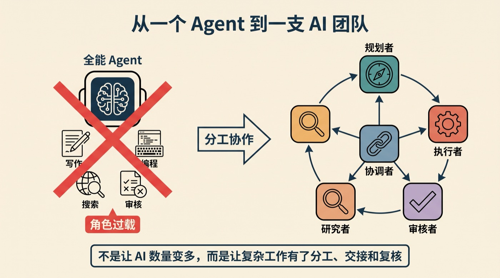
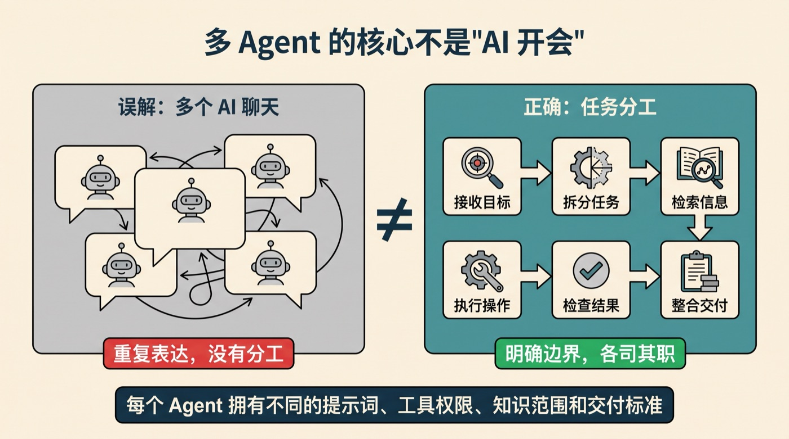
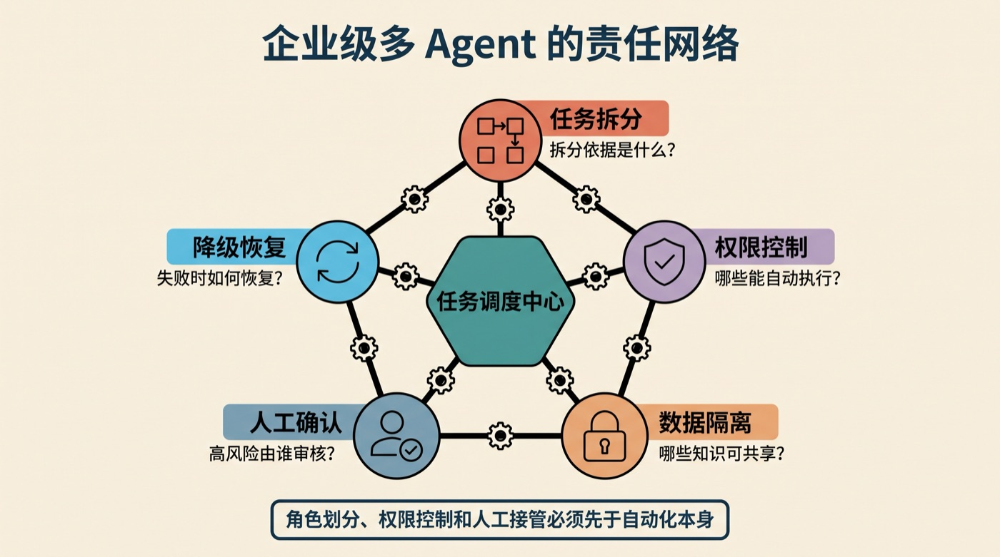

# agent-team-work

`agent-team-work` 用于在 Codex 项目中建立和运行严格串行的项目会话团队：一个当前 Leader，加上同一项目中的独立角色会话。它帮助团队先确认目标、角色、阶段和完成标准，再按已验收的阶段逐步派单。

## 主要功能

- 通过菜单确认项目、目标、角色、阶段顺序、DoD 和 `automatic` / `confirmation` 门控。
- 绑定真实项目和会话，避免重复创建 Leader 或把普通子代理当作团队成员。
- 只有成员报告、产物和能力门验收通过后，才推进下一阶段。
- 中断后按项目状态恢复；返修复用原成员并递增 `attempt`。
- 首轮完成后的修改先由 Lead 做 `impact_analysis`，记录新的 `revision_cycle`，再只派受影响阶段和必要下游阶段。

不用于概念解释、单次会话管理、普通子代理、并行 worker、Orca team、Sub-Lead 或子团队。

## 安装

下载 [runtime-only 发布包](dist/agent-team-work.zip)，解压到目标 Agent Skills 目录，或按宿主平台的 Skill 安装方式复制包体。

包内运行时文件包括 `SKILL.md`、`manifest.json`、Codex 接口元数据、流程/协议/角色参考和许可证；本仓库的测试、评测、报告与维护脚本不属于运行时依赖。

## 使用示例

在目标 Codex 项目中显式调用 `$agent-team-work`。通常只需要说明想做什么，不必预先写角色和阶段；Skill 会先通过菜单补齐这些信息。

```text
我想做 XXXXX，组建团队完成。
```

需要修改已经完成的团队时，可以直接说：

```text
我想修改刚完成的 XXXXX，请让 Lead 先分析影响再安排必要返工。
```

只想查看状态时，可以说：

```text
看一下当前团队状态。
```

## Demo 项目实景

下面的图片来自 Demo 项目一次真实团队交付的配图目录，不是为了文档另做的占位图。这个项目的启动目标类似于“创建一个创作团队，完成每周微信公众号的文章撰写工作”，由 Lead 先确认角色和阶段，再逐步推进研究、核验、写作、视觉和排版。



*Demo 实际产物：把单一 Agent 的多种职责拆成可交接的团队角色。*



*Demo 实际产物：从接收目标、拆分任务到检查结果和整合交付。*



*Demo 实际产物：把任务拆分、权限控制、人工确认和失败恢复纳入同一条交付链。*

## 进一步阅读

- [完整工作流程](references/workflow.md)
- [调度与状态协议](references/team-protocol.md)
- [Codex 工具规则](references/codex-tools.md)
- [角色预设](references/role-presets.md)
- [团队规模边界](references/team-scaling.md)

## 许可

MIT，详见 [LICENSE](LICENSE)。
